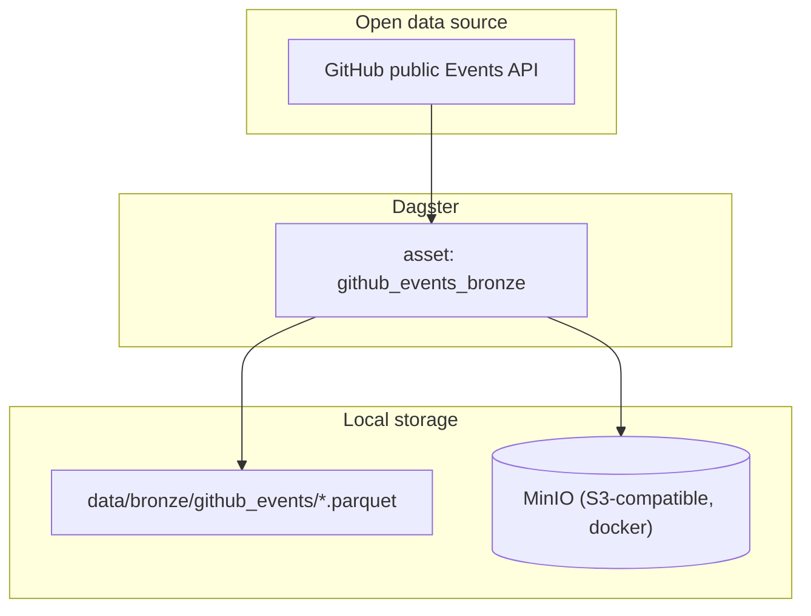
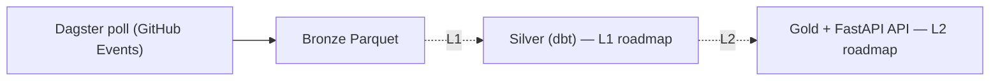

# System Overview — lakehouse-lab

> Ecosystem node: `lakehouse-lab`（role: showcase）— 跨專案關係見 platform-command `dashboards/GRAPH.md`；文件慣例見 platform-command `docs/architecture-doc-convention.md`。

個人 data-platform 參考實作：把**開放資料**（GitHub public Events）以 medallion 風格導入本機 lakehouse（L0 bootstrap）— MinIO + Dagster + Parquet。

> Red line：只用 open data；不重現任何專有系統、商業邏輯或內部架構。

## 元件圖（Components）

## 主要流程（Primary flow）— medallion L0

目前落地 L0（compose + GitHub Events → bronze）。L1（batch/CDC + dbt silver/gold）與 L2（FastAPI gold API + PWA dashboard）為 roadmap。

## 對外整合（Integrations）

- **Runtime**：Docker Compose 起 MinIO；`dagster dev -f lakehouse_lab/definitions.py`。
- **Data**：Parquet（pandas / pyarrow）；bronze 落在 `data/bronze/`。
- **Registry**：platform-command → `lakehouse-lab`（role: showcase）。

## 邊界與不變式（Boundaries）

- 只導入公開資料；不放專有/內部系統。
- L0 為當前可運作範圍；L1/L2 尚未實作（roadmap only）。

*Created 2026-09-17 — 依 platform-command architecture-doc-convention。*
